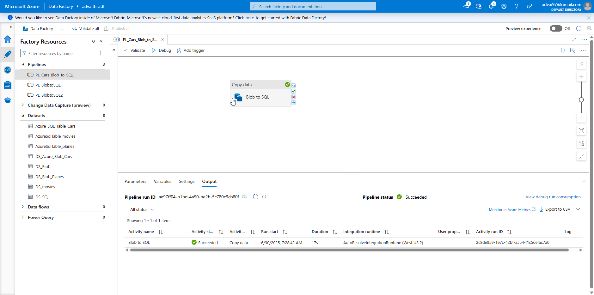
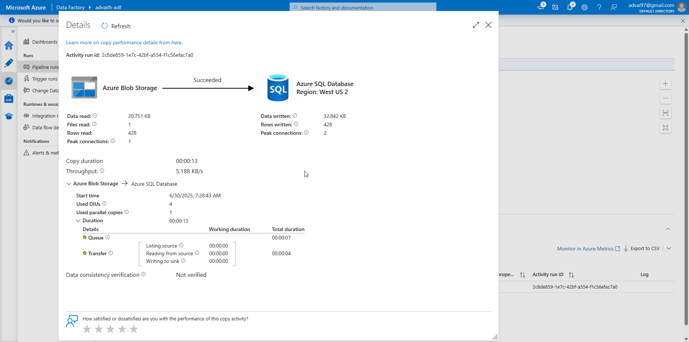
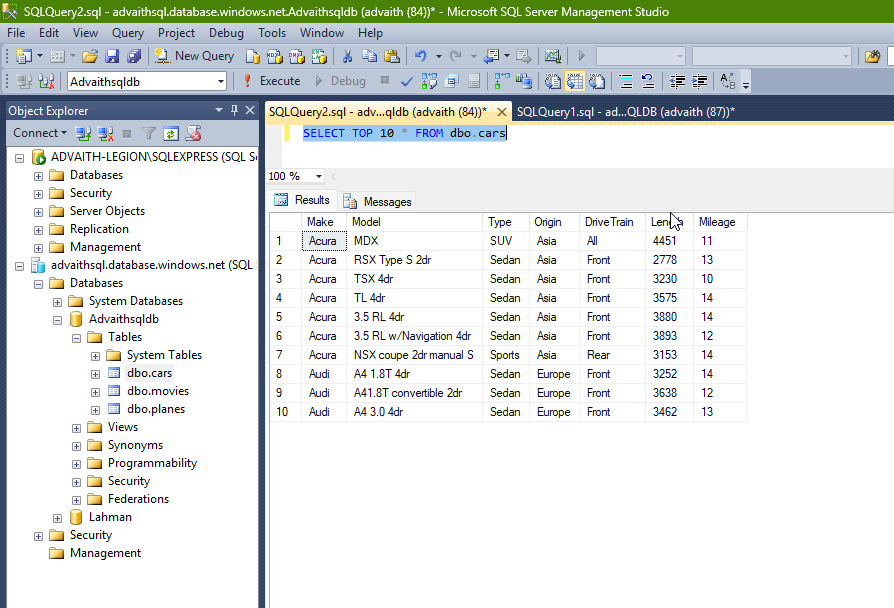

# 🚗 cars.csv to Azure SQL using Azure Data Factory

This is a hands-on Azure Data Factory (ADF) pipeline I built to move data from a CSV file in Azure Blob Storage into a structured table in Azure SQL Database.

The goal was to get practical experience with connecting source and destination systems, configuring datasets and linked services, and automating data movement with ADF. It’s a foundational project, but it covers all the core components clearly and end-to-end.

The purpose was to get practical experience with connecting source and destination systems, configuring datasets and linked services, and automating data movement with ADF. It’s a foundational pipeline, but it covers all the core components clearly.

---

## 🧠 What This Pipeline Does

- Takes a CSV file called `cars.csv` stored in a Blob container named `datasets`
- Maps it to a table called `cars` in Azure SQL Database
- Inserts the records directly without transformations

---

## 🔗 Linked Services

| Name                  | Type              | Description                                 |
|-----------------------|-------------------|---------------------------------------------|
| `LS_AzureBlobStorage` | AzureBlobStorage  | Connects to Azure Blob Storage (source)     |
| `LS_AzureSqlDatabase` | AzureSqlDatabase  | Connects to Azure SQL Database (destination)|


> 🔒 Credentials and connection strings have been masked in the exported JSONs.

---

## 📁 Datasets

| Name                   | Type           | Description                                  |
|------------------------|----------------|----------------------------------------------|
| `DS_Azure_Blob_Cars`   | DelimitedText  | Source CSV dataset from Blob Storage         |
| `Azure_SQL_Table_Cars` | AzureSqlTable  | Target dataset for SQL table `dbo.cars`      |

The CSV includes the following columns:  
`Make`, `Model`, `Type`, `Origin`, `DriveTrain`, `Length`, `Mileage`

---

## 🛠️ SQL Table Schema

Here’s the SQL structure I used for the destination table:

```sql
CREATE TABLE dbo.cars (
    Make VARCHAR(100),
    Model VARCHAR(100),
    Type VARCHAR(50),
    Origin VARCHAR(50),
    DriveTrain VARCHAR(50),
    Length INT,
    Mileage INT
);
```

---

## 🖼️ Pipeline Screenshots

### 📌 Pipeline Diagram

This is the pipeline layout in ADF Studio:



---

### 📌 Pipeline Execution Run

Successful pipeline execution with status and timestamps:



---

### 📌 Copy Activity Output

Copy activity output details showing rows read and written:


---

### 📌 SQL Table Preview (SSMS)

Result of a `SELECT TOP 10 * FROM dbo.cars` run in SQL Server Management Studio:



---

## ✍️ Why I Built This

I'm currently transitioning into a Data Engineering role, and I wanted to reinforce my understanding of Azure Data Factory by building pipelines from scratch — not just following along with tutorials.

This pipeline helped me:
- Understand how ADF connects to both cloud storage and relational databases
- Define and configure datasets and linked services
- Execute and monitor a full data load end-to-end
- Prepare for more complex patterns like dynamic pipelines and parameterization

---

## 📊 Pipeline Details

| Property          | Value                    |
|-------------------|--------------------------|
| Name              | `PL_Cars_Blob_to_SQL`    |
| Activity Type     | Copy                     |
| Source            | DelimitedText (CSV file) |
| Sink              | Azure SQL Table          |
| Mapping           | Tabular (column-to-column) |
| Write Behavior    | Insert                   |
| Translator Config | Enabled with type conversion |

---

## 📦 Files in This Folder

| File                          | Description                                |
|-------------------------------|--------------------------------------------|
| `PL_Cars_Blob_to_SQL.json`    | Main ADF pipeline definition                |
| `DS_Azure_Blob_Cars.json`     | Dataset for the CSV file in Blob           |
| `Azure_SQL_Table_Cars.json`   | Dataset for the target SQL table           |
| `LS_AzureBlobStorage.json`    | Linked Service to Blob Storage             |
| `LS_AzureSqlDatabase.json`    | Linked Service to Azure SQL                |
| `CarsTable.sql`               | SQL script to create the `cars` table      |
| `screenshot_pipeline_diagram.png` | Pipeline design in ADF Studio        |
| `screenshot_pipeline_run.png`     | Pipeline execution monitoring view    |
| `screenshot_copy_output.png`      | Copy activity output (rows copied)    |
| `screenshot_sql_query_result.png` | SQL table query output preview        |
| `README.md`                   | This documentation                         |

---

## ✅ What's Next

This project was my first step toward using ADF confidently. Next, I’m planning to:

- Add parameters and dynamic file ingestion
- Work with different file formats like JSON and Parquet
- Build pipelines that load data from REST APIs
- Implement error handling and logging

---


Thanks for reading! Feel free to explore the JSON files or reach out if you're also learning ADF.