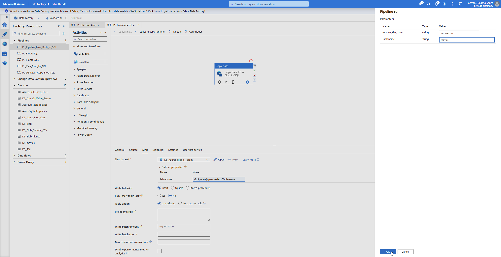
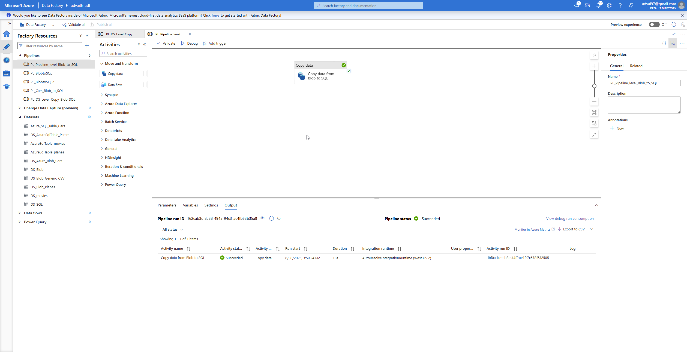
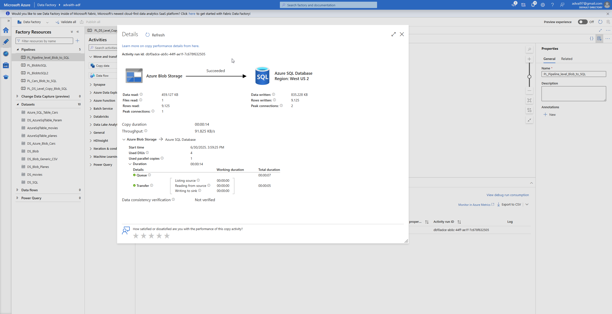
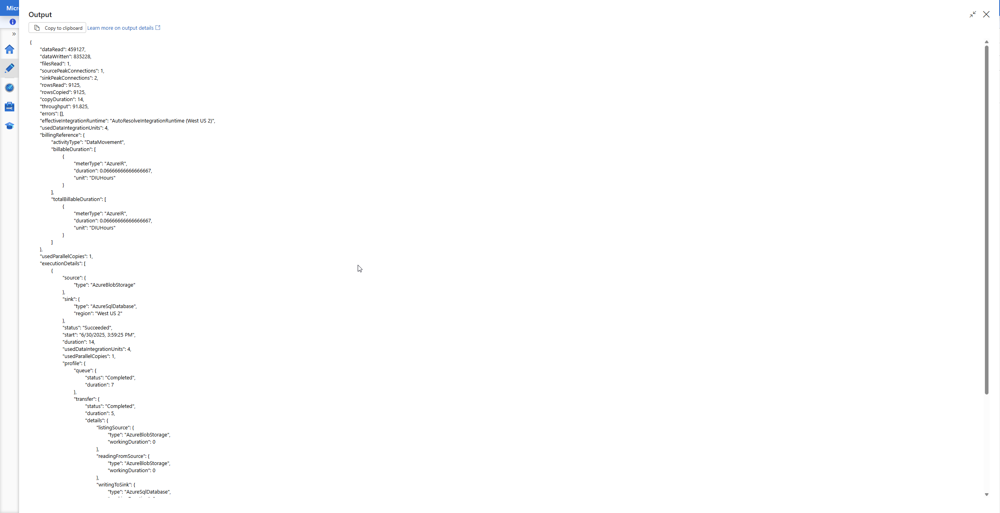
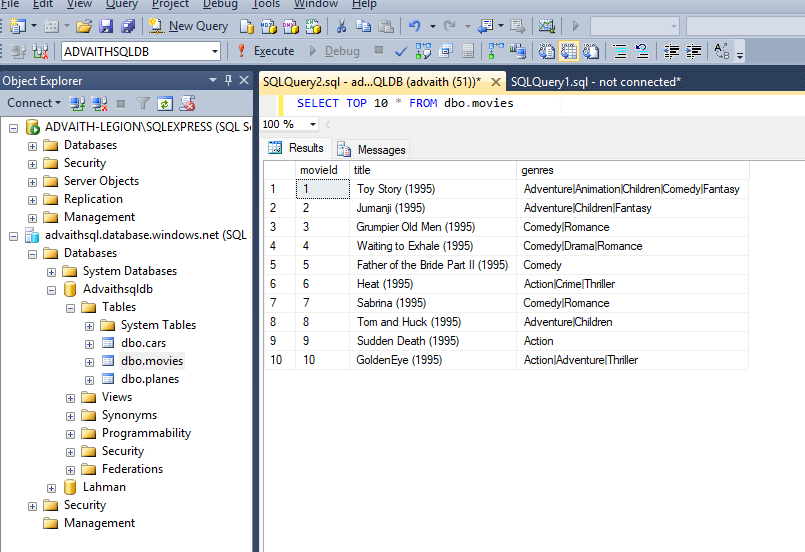

# ⚙️ ADF Pipeline: CSV to SQL Using Pipeline-Level Parameters

This project demonstrates a streamlined Azure Data Factory pipeline that uses **pipeline-level parameters** to ingest CSV files from Azure Blob Storage into Azure SQL Database. Instead of parameterizing datasets, this pipeline passes values directly to source and sink via pipeline-level parameters at runtime (e.g., during debug).

---

## 🔍 Key Highlights

- Passes `relative_File_name` and `tablename` as pipeline parameters.
- Uses those parameters to configure a generic source dataset and a generic sink dataset.
- Simplifies execution and is ideal for quick debugging or single-file ingestion.

---

## 🧩 Parameters Used

| Parameter Name        | Description                                  |
|-----------------------|----------------------------------------------|
| `relative_File_name`  | Path to CSV file inside blob container       |
| `tablename`           | Target table name in Azure SQL Database      |

---

## 🗂️ Reused Components

| Component                   | Description                                  |
|-----------------------------|----------------------------------------------|
| `DS_Blob_Generic_CSV`       | Source dataset for CSVs (parameterized)      |
| `DS_AzureSqlTable_Param`    | Sink dataset for SQL tables (parameterized)  |
| `DS_AzureBlobStorage_param` | Linked service for Blob Storage              |
| `LS_AzureSqlDatabase`       | Linked service for Azure SQL Database        |

---

## 🧱 SQL Table Schema: `movies`

```sql
CREATE TABLE [dbo].[movies](
	[movieId] [varchar](50),
	[title] [varchar](max),
	[genres] [varchar](max)
)
```

---

## 🖼️ Screenshots

- **Pipeline asking for parameters just before Debug:**  
  

- **Pipeline Diagram**  
  

- **Pipeline Run Monitoring**  
  

- **Copy Activity Metrics Output**  
  

- **SQL Table Result**  
  

---

## 📁 Files in This Folder

| File Name                        | Description                                      |
|----------------------------------|--------------------------------------------------|
| `PL_Pipeline_Level_Params.json`  | ADF pipeline with pipeline-level parameter usage |
| `Movies_table_schema.sql`        | Movies SQL table structure                       |

---

Thanks for checking this out! This approach is great for quick tests and helps understand how ADF pipeline level parameter passing works.