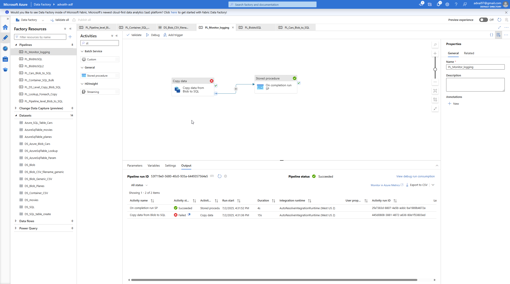
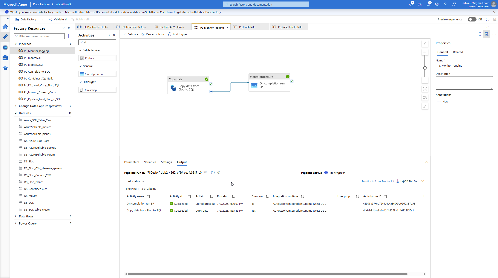
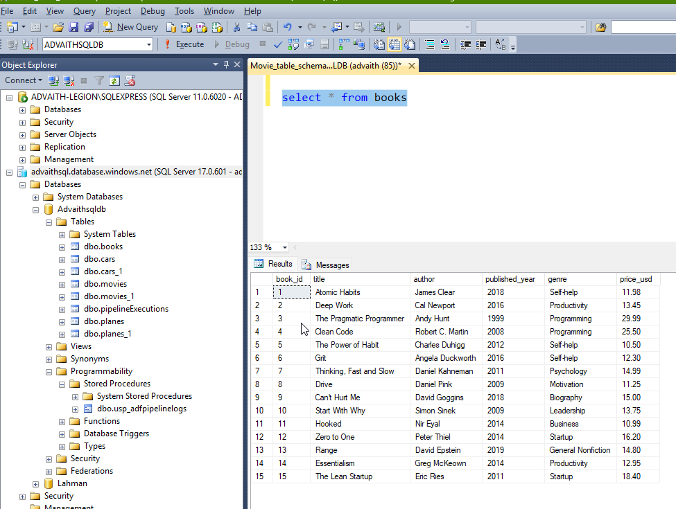
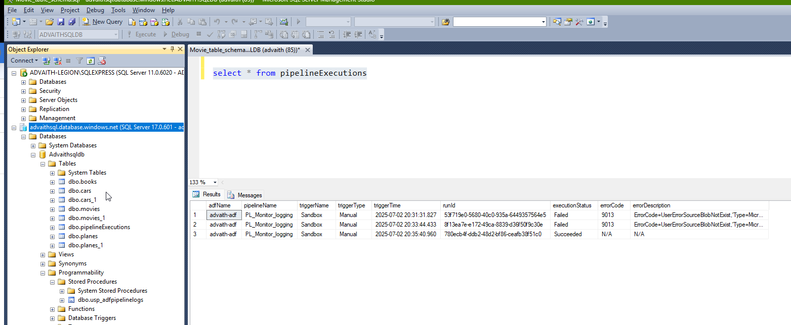

# 📄 ADF Pipeline with Execution Logging

This Azure Data Factory (ADF) pipeline demonstrates how to implement **pipeline-level execution logging** by capturing and storing metadata and errors from pipeline runs into an audit table in Azure SQL Database.

---

## 🚀 What This Pipeline Does

1. **Copy Activity**: Loads the contents of `books.csv` from Azure Blob Storage into an Azure SQL table named `books`.
2. **Logging Procedure Call**: Executes a stored procedure (`usp_adfpipelinelogs`) after the copy operation to log details about the pipeline run.
3. **Error Handling**: Captures errors (if any) and stores them in the `pipelineExecutions` table along with pipeline metadata like name, trigger, and status.

---

## 🗂️ SQL Objects

### ✅ Target Table

```sql
CREATE TABLE books (
    book_id INT PRIMARY KEY,
    title VARCHAR(100),
    author VARCHAR(100),
    published_year INT,
    genre VARCHAR(50),
    price_usd DECIMAL(6, 2)
);
```

### 🧾 Audit Table

```sql
CREATE TABLE pipelineExecutions (
    adfName VARCHAR(50),
    pipelineName VARCHAR(50),
    triggerName VARCHAR(50),
    triggerType VARCHAR(50),
    triggerTime DATETIME,
    runId VARCHAR(50),
    executionStatus VARCHAR(50),
    errorCode VARCHAR(50),
    errorDescription VARCHAR(500)
);
```

### 🔁 Stored Procedure

```sql
CREATE PROC dbo.usp_adfpipelinelogs (
    @adfName VARCHAR(50),
    @pipelineName VARCHAR(50),
    @triggerName VARCHAR(50),
    @triggerType VARCHAR(50),
    @triggerTime DATETIME,
    @runId VARCHAR(50),
    @executionStatus VARCHAR(50),
    @errorCode VARCHAR(50),
    @errorDescription VARCHAR(500)
)
AS
BEGIN
    INSERT INTO pipelineExecutions
    VALUES (
        @adfName, @pipelineName, @triggerName, @triggerType, @triggerTime,
        @runId, @executionStatus, @errorCode, @errorDescription
    );
END
```

---

## 🔗 Key Activities in ADF

### 1. `Copy data from Blob to SQL`

- Source: `books.csv` from Azure Blob
- Sink: `books` table in Azure SQL
- Translator: Tabular mapping
- Sink behavior: `insert`

### 2. `On completion run SP`

- Executes stored procedure on success or failure
- Pulls values from system variables:
  - `@pipeline().Pipeline`, `@pipeline().RunId`, etc.
- Error logic:
```adf
@if(
  equals(activity('Copy data from Blob to SQL').output.executionDetails[0].status, 'Succeeded'),
  'N/A',
  activity('Copy data from Blob to SQL').output.errors[0].Code
)
```

---

## 🖼️ Screenshots


- **Failed pipeline run as shown in ADF Monitor:**  
    
- **Successful pipeline run as shown in ADF Monitor:**  
    
- **Contents of the `books` sql table after data load:**  
    
- **Audit log entries in the `pipelineExecutions` table after multiple executions:**  
    

---

## ✅ Benefits

- Enables visibility into success/failure of each pipeline run
- Logs both metadata and error info for audit/debug purposes
- Clean separation of logic and logging using stored procedures

---

Thank you for exploring this project! If you found it helpful or have suggestions for improvement, feel free to contribute or reach out.

