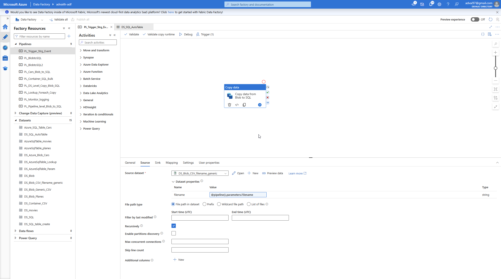
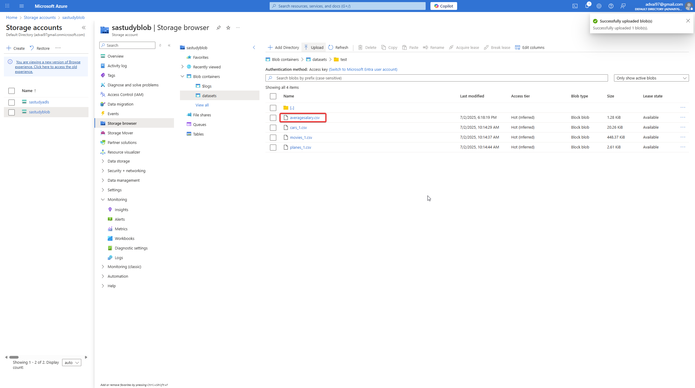
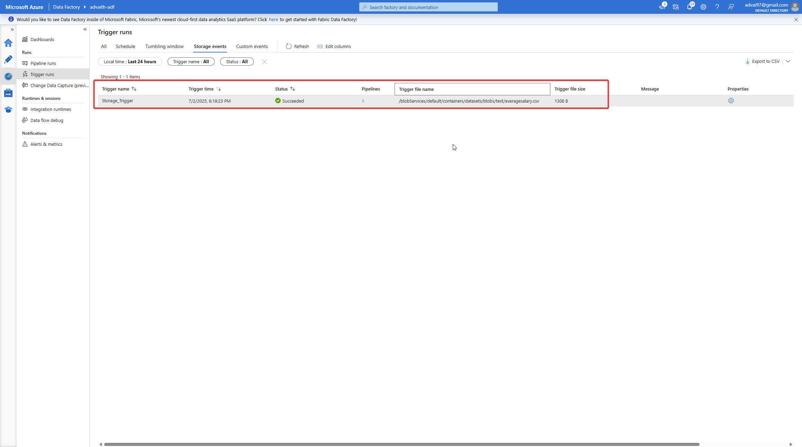
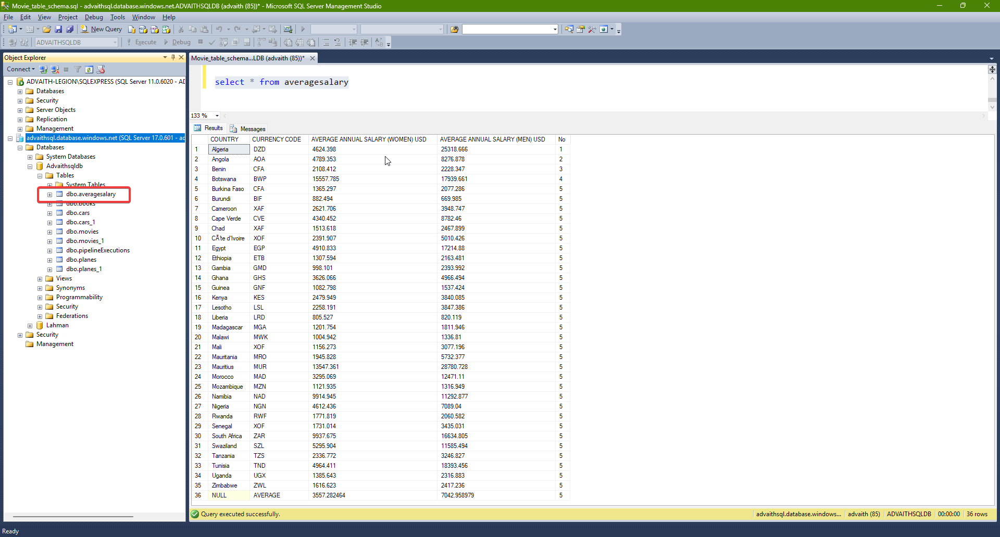

# 📄 ADF Pipeline with Storage Event Trigger

This project demonstrates how to use **Azure Data Factory (ADF)** in conjunction with a **Storage Event Trigger** to initiate pipeline runs based on blob events. A new file uploaded to a specified container automatically triggers the pipeline, which ingests the data into a SQL table.

---

## 🚀 What This Pipeline Does

1. Listens for `.csv` files uploaded to the folder `/datasets/blobs/test/` in a Blob Storage container.
2. Uses a **Storage Event Trigger** (`Storage_Trigger`) to launch the pipeline `PL_Trigger_Strg_Event`.
3. Dynamically passes the uploaded file name to the pipeline using system trigger metadata.
4. Pipeline copies the contents of the uploaded CSV file into a corresponding SQL table (auto-created using the file name, without `.csv`).

---

## ⚙️ ADF Components

### 📦 Pipeline: `PL_Trigger_Strg_Event`

- Parameter: `Filename` (passed from trigger)
- Activities:
  - **Copy Data** from the blob file to an Azure SQL table.
  - Sink table name is derived by stripping `.csv` from the file name.

### 🔔 Trigger: `Storage_Trigger`

- Type: `BlobEventsTrigger`
- Events: `Microsoft.Storage.BlobCreated`
- Filters:
  - `blobPathBeginsWith: /datasets/blobs/test/`
  - `blobPathEndsWith: .csv`
- Pipeline parameters:
  - `Filename: @triggerBody().FileName`

---

## 🛠️ One-Time Setup Requirements

### 1. Register the Event Grid Provider

In Azure CLI:
```bash
az provider register --namespace Microsoft.EventGrid
```

---

### 2. Assign IAM Role to ADF Managed Identity

Go to **Storage Account → Access Control (IAM)** and:
- Add Role: `Storage Blob Data Contributor`
- Assign to: the **Managed Identity** of your **ADF instance**

This is required for ADF to listen to events from the storage account via Event Grid.

---

## 🖼️ Screenshots

1.   
   _Diagram of the pipeline with copy activity and parameter usage._

2.   
   _File 'averagesalary.csv' added manually to the monitored blob folder._

3.   
   _Screenshot showing successful pipeline run triggered by blob event._

4.   
   _Data successfully inserted into SQL table matching the file name._

---

## ✅ Benefits

- Fully automated ingestion pipeline using event-driven architecture.
- No manual trigger or schedule needed — responsive to real-time events.
- Supports flexible file naming and scalable ingestion logic.

---
Thank you for exploring this project! If you have questions or suggestions, feel free to open an issue or contribute. Happy building with Azure Data Factory!
