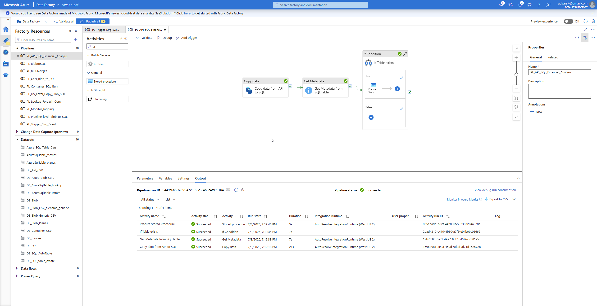
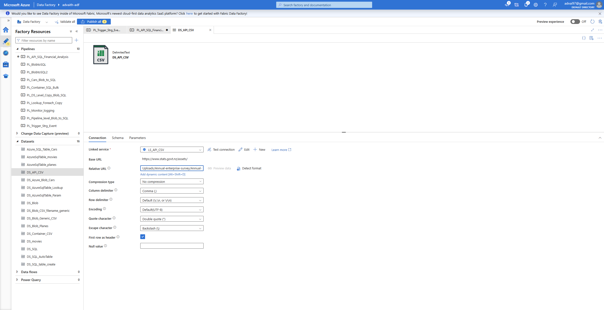
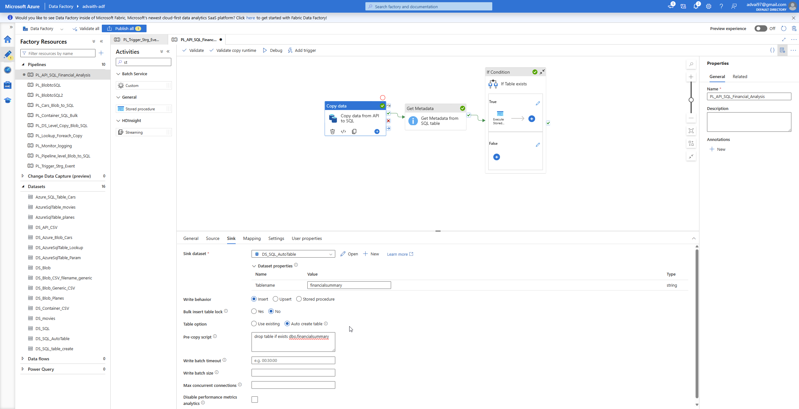
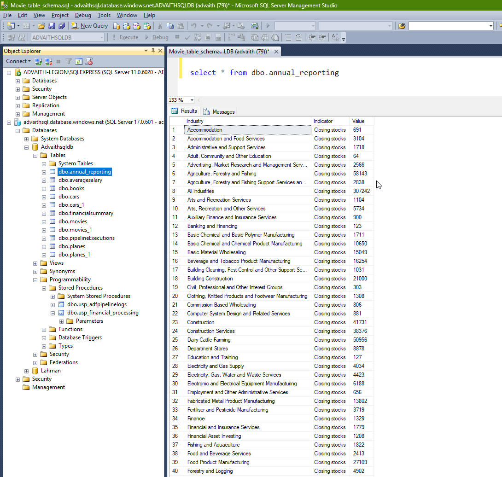

# 🚀 ADF Pipeline: Load CSV Data from API to Azure SQL with Auto Schema + Post-Processing

This Azure Data Factory (ADF) pipeline demonstrates how to:

1. Ingest CSV data from a public API (via direct download link)
2. Store it in Azure SQL Database with auto-created schema
3. Execute a post-processing stored procedure based on a conditional check

---

## 📊 Use Case

The source is an official government dataset:  
[Annual Enterprise Survey 2023 (NZ Stats)](https://www.stats.govt.nz/assets/Uploads/Annual-enterprise-survey/Annual-enterprise-survey-2023-financial-year-provisional/Download-data/annual-enterprise-survey-2023-financial-year-provisional.csv)

This data is copied into a SQL table `dbo.financialsummary`, and a stored procedure aggregates financial performance indicators into a summary table `dbo.annual_reporting`.

---

## 🏗️ Pipeline Overview

### 📌 ADF Pipeline: `PL_API_SQL_Financial_Analysis`

**Steps:**

1. **Copy Activity** – Reads CSV from HTTP API and inserts into SQL table (`dbo.financialsummary`), with auto table creation. Drops table if it already exists.
2. **Get Metadata** – Verifies if the target table (`financialsummary`) exists.
3. **If Condition** – If table exists, a stored procedure is executed for further processing.

**Entire pipeline view with monitor output**


---

## 📁 Datasets & Linked Services

### 🔗 Source Dataset: `DS_API_CSV`
- Type: HTTP DelimitedText
- Relative URL:  
  `Uploads/Annual-enterprise-survey/Annual-enterprise-survey-2023-financial-year-provisional/Download-data/annual-enterprise-survey-2023-financial-year-provisional.csv`

**DS_API_CSV**

---

### 🗃️ Sink Dataset: `DS_SQL_AutoTable`
- Type: Azure SQL Table
- Table name passed as parameter
- Target table: `dbo.financialsummary`

---
## 📌 Execution Logic

- Table creation is handled automatically using ADF's `autoCreate` option in the SQL Sink.
- A `preCopyScript` is used to drop `financialsummary` if it already exists.
- The `Get Metadata` activity checks table existence and only triggers post-processing if present.

**DS_SQL_AutoTable**


---

## 🧠 Stored Procedure Logic

### 📄 SQL Objects:

```sql
CREATE TABLE dbo.annual_reporting (
    Industry VARCHAR(255),
    Indicator VARCHAR(255),
    Value FLOAT
);
```

```sql
CREATE PROCEDURE dbo.usp_financial_processing AS
BEGIN
    TRUNCATE TABLE dbo.annual_reporting;

    WITH cte AS (
        SELECT 
            Industry_name_NZSIOC,
            Variable_name,
            SUM(TRY_CAST(Value AS FLOAT)) AS amount
        FROM financialsummary
        WHERE Variable_category = 'Financial performance'
        GROUP BY Industry_name_NZSIOC, Variable_name
    )
    INSERT INTO dbo.annual_reporting
    SELECT Industry_name_NZSIOC, Variable_name, amount
    FROM cte;
END;
```

This aggregates financial data by industry and indicator into a clean summary format.
---


---

## 📦 Files in this Repo

| File | Description |
|------|-------------|
| `PL_API_SQL_Financial_Analysis.json`  | ADF pipeline definition |
| `DS_API_CSV.json`                     | Source dataset pointing to public CSV |
| `DS_SQL_AutoTable.json`               | Sink dataset with dynamic table binding |
| `README.md`                           | This file |
| `scr_*`                               | Screenshots mentioned in this file |

---

## ✅ Prerequisites

- Azure Data Factory instance
- Azure SQL Database with a user having permission to run `DROP TABLE` and `CREATE TABLE`
- Public CSV endpoint accessible from ADF

---

## 🏁 Output Table

**Final SQL Table: `dbo.annual_reporting` queried in ssms:**


