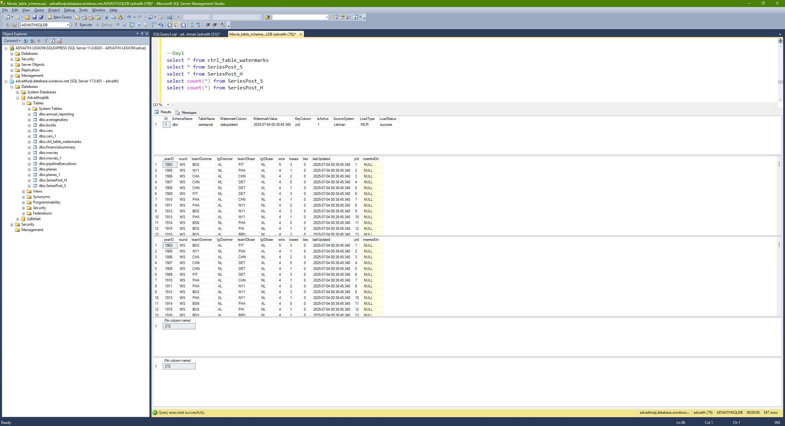
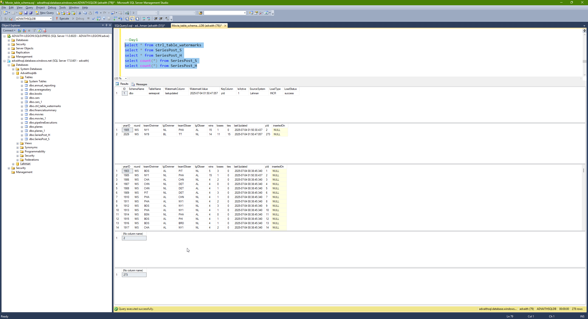
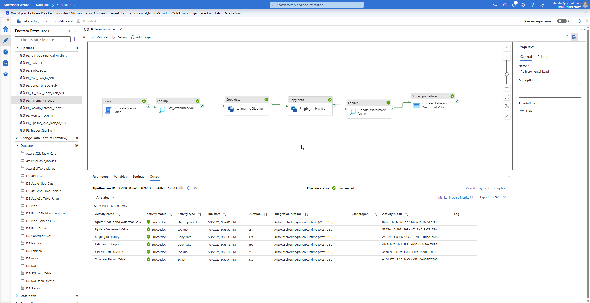

# ADF Incremental Load Pipeline — Lahman SeriesPost Example

This project demonstrates how to implement an **Incremental Load** pattern using Azure Data Factory (ADF) with the **Lahman Baseball database**.

---

## 📌 Overview

We load data from a source Azure SQL DB (imported Lahman DB) to staging and historical tables using a watermark-based incremental logic.


---

## 🔧 Steps

### 1️⃣ Lahman Database Import
The Lahman dataset is imported into Azure SQL Database using a **BACPAC file**.

---

### 2️⃣ Modify Source Table

We enhance the `seriespost` table to support incremental loads:

```sql
ALTER TABLE seriespost ADD lastUpdated DATETIME NOT NULL DEFAULT GETDATE();
ALTER TABLE seriespost ADD pId INT NOT NULL IDENTITY(1, 1);
```

---

### 3️⃣ Create Watermark Table

```sql
CREATE TABLE ctrl_table_watermarks (
    ID INT IDENTITY(1,1),
    SchemaName VARCHAR(100),
    TableName VARCHAR(100),
    WatermarkColumn VARCHAR(100),
    WatermarkValue DATETIME,
    KeyColumn VARCHAR(100),
    IsActive INT,
    SourceSystem VARCHAR(100),
    LoadType VARCHAR(100),
    LoadStatus VARCHAR(100)
);

INSERT INTO ctrl_table_watermarks
(SchemaName, TableName, WatermarkColumn, WatermarkValue, KeyColumn, IsActive, SourceSystem, LoadType, LoadStatus)
VALUES ('dbo','seriespost','lastupdated','1900-01-01','pId',1,'Lahman','INCR','');
```

This initializes the control table for incremental load logic.

---

### 4️⃣ Create Staging & History Tables

```sql
CREATE TABLE SeriesPost_S (...same columns as source...);
CREATE TABLE SeriesPost_H (...same columns as source...);
```

Both contain `lastUpdated`, `pId`, and `insertedOn` columns.

---

### 5️⃣ Create Stored Procedure

```sql
CREATE PROC usp_update_watermark_status (
    @tableName VARCHAR(100),
    @status VARCHAR(100),
    @datetime DATETIME = NULL
)
AS
BEGIN
    UPDATE ctrl_table_watermarks
    SET LoadStatus = @status, WatermarkValue = @datetime
    WHERE TableName = @tableName
END
```

This is triggered from ADF after staging-to-history is done.

---

### 6️⃣ ADF Pipeline Logic

Activities include:
- Truncate staging
- Get watermark
- Copy from Lahman to staging (`WHERE lastUpdated > watermark`)
- Copy from staging to history (`upsert on pId`)
- Lookup latest `lastUpdated` from history
- Call stored proc to update watermark

✅ See full pipeline diagram above.

---

### 7️⃣ Testing

#### 🧪 Day 1 (Initial Load)

- `seriespost` table has **272 rows**
- `SeriesPost_S` → 272 rows
- `SeriesPost_H` → 272 rows



#### 🧪 Day 2 (One update + one insert)

- Updated 1 row + Inserted 1 row
- `SeriesPost_S` → 2 rows
- `SeriesPost_H` → 273 rows





---

## ✅ Result

This project demonstrates a robust and parameterized **incremental data load** pattern using Azure Data Factory, ideal for staging/archival or data warehousing ETL flows.

---

## 📁 Files Included

- `PL_Incremental_Load.json` — Full ADF pipeline export
- Screenshots of execution and validation

---

## 🧠 Author Notes

- Project showcases a reusable ETL framework
- ADF pipeline uses dynamic expressions for watermark evaluation
- Metadata-driven design for scaling to multiple tables

---

## 🔗 References

- [Lahman Baseball Database](http://www.seanlahman.com/baseball-archive/statistics/)
- [Azure Data Factory Docs](https://learn.microsoft.com/en-us/azure/data-factory/introduction)

---
Thank you for exploring this Azure Data Factory incremental load example! If you have questions or suggestions, feel free to contribute or reach out.