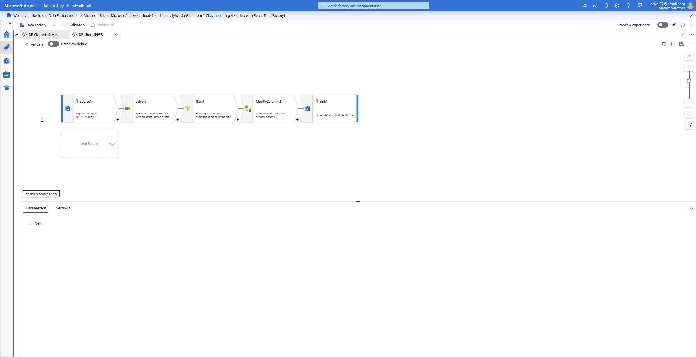

# 🎬 Azure Data Factory: Movie Dataset Dataflows

This repository showcases two Azure Data Factory (ADF) Mapping Data Flows used for cleaning, transforming, and analyzing a raw movie dataset. It includes screenshots of the dataflows, pipelines, and final outputs from Azure Blob Storage.

---

## 📁 Dataflows Included

| Dataflow Name       | Purpose                                                                 |
|---------------------|-------------------------------------------------------------------------|
| `DF_Cleaned_Movies` | Extracts year from title, cleans up title text, and aggregates movie count per year |
| `DF_filter_UPPER`   | Filters movie titles longer than 20 characters and converts them to uppercase |

---

## 🧪 Dataset Sample

---

## 🔧 What Each Dataflow Does

### 🔹 `DF_Cleaned_Movies`
- **Source:** `DS_DF_Movies`
- **Transformations:**
  - Extracts the year from the `title` column.
  - Removes year from the movie title text.
  - Aggregates number of movies per year.
- **Outputs:**
  - `sink1`: Cleaned movie data → partitioned by title.
  - `sink2`: Number of movies per year → partitioned by year.

#### 🔁 Data Flow Design

#### ✅ Pipeline Execution

#### 🗂️ Outputs

- **Cleaned Movie Titles:**

  

- **Movie Count Per Year:**

  

---

### 🔹 `DF_filter_UPPER`
- **Source:** `DS_DF_Movies`
- **Transformations:**
  - Selects only `movieId` and `title`.
  - Filters titles longer than 20 characters.
  - Converts `title` to uppercase.
- **Output:**
  - `sink1`: Filtered and uppercased titles → partitioned by title.

#### 🔁 Data Flow Design

#### ✅ Pipeline Execution

#### 🗂️ Output

---

## 🧩 Datasets Used

| Dataset Reference       | Description                               |
|-------------------------|-------------------------------------------|
| `DS_DF_Movies`          | Source dataset containing raw movie data  |
| `DS_DF_Movies_Cleaned`  | Sink for aggregated movie counts (DF_Cleaned_Movies) |
| `DS_Blob_DF_OP`         | Sink for final partitioned outputs        |

---

Thank you for checking out this demonstration of what can be achieved using dataflows in ADF.