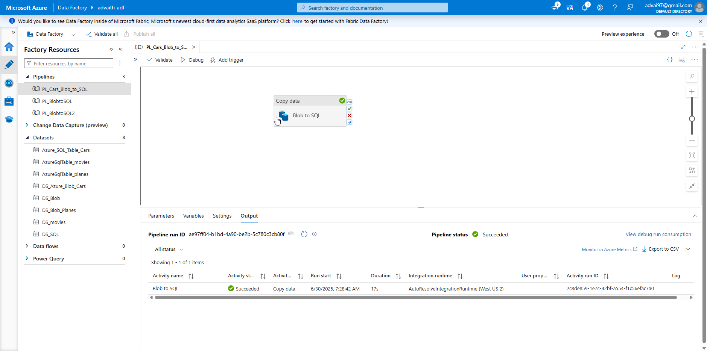
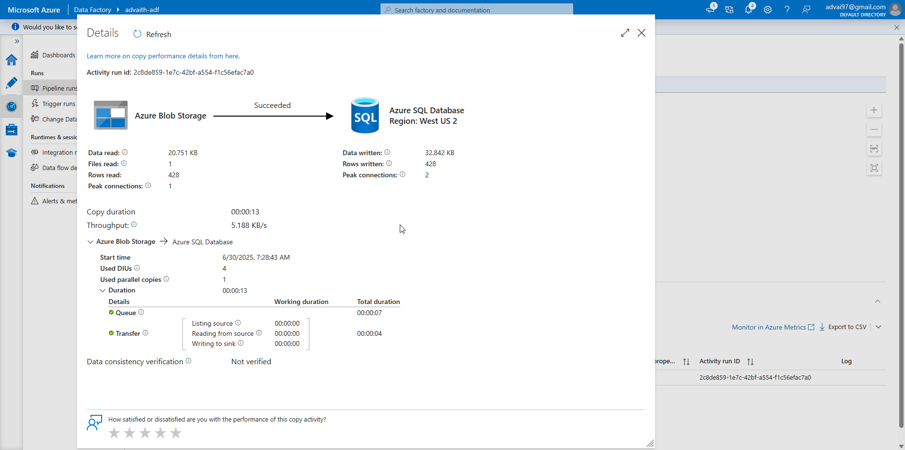
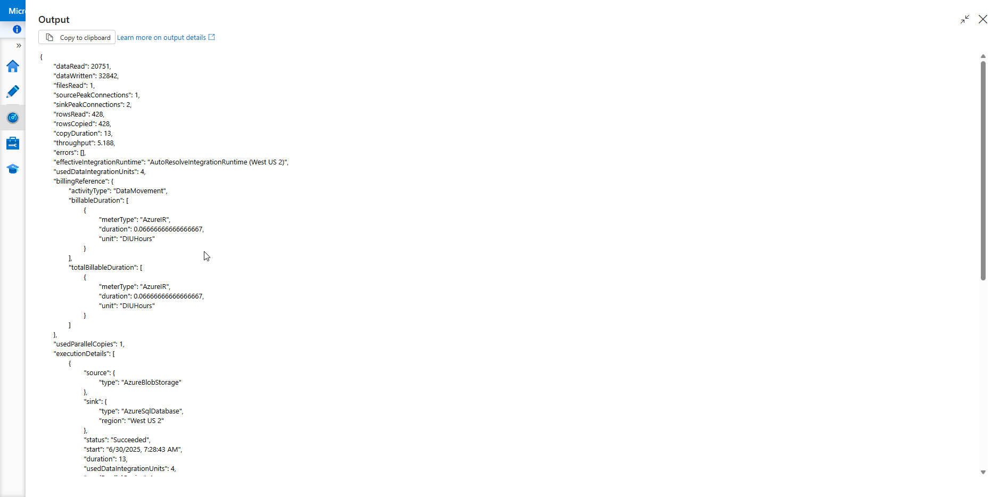
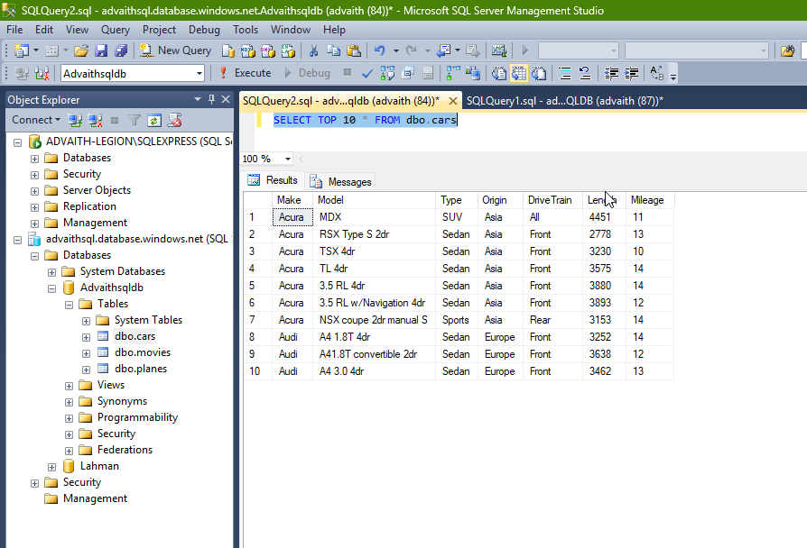

# 🚗 cars.csv to Azure SQL using Azure Data Factory

This is a hands-on Azure Data Factory (ADF) pipeline I built to move data from a CSV file in Azure Blob Storage into a structured table in Azure SQL Database.

<<<<<<< HEAD
The goal was to get practical experience with connecting source and destination systems, configuring datasets and linked services, and automating data movement with ADF. It’s a foundational project, but it covers all the core components clearly and end-to-end.
=======
The purpose was to get practical experience with connecting source and destination systems, configuring datasets and linked services, and automating data movement with ADF. It’s a foundational pipeline, but it covers all the core components clearly.
>>>>>>> 503f8888a9d40049ef9b38257c33d8f0cd6def2a

---

## 🧠 What This Pipeline Does

- Takes a CSV file called `cars.csv` stored in a Blob container named `datasets`
- Maps it to a table called `cars` in Azure SQL Database
- Inserts the records directly without transformations

---

## 🔗 Linked Services

| Name                  | Type              | Description                                 |
|-----------------------|-------------------|---------------------------------------------|
| `LS_AzureBlobStorage` | AzureBlobStorage  | Connects to Azure Blob Storage (source)     |
| `LS_AzureSqlDatabase` | AzureSqlDatabase  | Connects to Azure SQL Database (destination)|

<<<<<<< HEAD
> 🔒 Credentials and connection strings have been masked in the exported JSONs.
=======
*Note: Credentials and connection strings have been masked.*
>>>>>>> 503f8888a9d40049ef9b38257c33d8f0cd6def2a

---

## 📁 Datasets

| Name                   | Type           | Description                                  |
|------------------------|----------------|----------------------------------------------|
| `DS_Azure_Blob_Cars`   | DelimitedText  | Source CSV dataset from Blob Storage         |
| `Azure_SQL_Table_Cars` | AzureSqlTable  | Target dataset for SQL table `dbo.cars`      |

<<<<<<< HEAD
The CSV includes the following columns:  
=======
The CSV includes these columns:  
>>>>>>> 503f8888a9d40049ef9b38257c33d8f0cd6def2a
`Make`, `Model`, `Type`, `Origin`, `DriveTrain`, `Length`, `Mileage`

---

## 🛠️ SQL Table Schema

Here’s the SQL structure I used for the destination table:

```sql
CREATE TABLE dbo.cars (
    Make VARCHAR(100),
    Model VARCHAR(100),
    Type VARCHAR(50),
    Origin VARCHAR(50),
    DriveTrain VARCHAR(50),
    Length INT,
    Mileage INT
);
<<<<<<< HEAD
```

---

## 🖼️ Pipeline Screenshots

### 📌 Pipeline Diagram

This is the pipeline layout in ADF Studio:



---

### 📌 Pipeline Execution Run

Successful pipeline execution with status and timestamps:



---

### 📌 Copy Activity Output

Copy activity output details showing rows read and written:



---

### 📌 SQL Table Preview (SSMS)

Result of a `SELECT TOP 10 * FROM dbo.cars` run in SQL Server Management Studio:



---

## ✍️ Why I Built This

I'm currently transitioning into a Data Engineering role, and I wanted to reinforce my understanding of Azure Data Factory by building pipelines from scratch — not just following along with tutorials.

This pipeline helped me:
- Understand how ADF connects to both cloud storage and relational databases
- Define and configure datasets and linked services
- Execute and monitor a full data load end-to-end
- Prepare for more complex patterns like dynamic pipelines and parameterization

---

## 📊 Pipeline Details

| Property          | Value                    |
|-------------------|--------------------------|
| Name              | `PL_Cars_Blob_to_SQL`    |
| Activity Type     | Copy                     |
| Source            | DelimitedText (CSV file) |
| Sink              | Azure SQL Table          |
| Mapping           | Tabular (column-to-column) |
| Write Behavior    | Insert                   |
| Translator Config | Enabled with type conversion |

---

## 📦 Files in This Folder

| File                          | Description                                |
|-------------------------------|--------------------------------------------|
| `PL_Cars_Blob_to_SQL.json`    | Main ADF pipeline definition                |
| `DS_Azure_Blob_Cars.json`     | Dataset for the CSV file in Blob           |
| `Azure_SQL_Table_Cars.json`   | Dataset for the target SQL table           |
| `LS_AzureBlobStorage.json`    | Linked Service to Blob Storage             |
| `LS_AzureSqlDatabase.json`    | Linked Service to Azure SQL                |
| `CarsTable.sql`               | SQL script to create the `cars` table      |
| `screenshot_pipeline_diagram.png` | Pipeline design in ADF Studio        |
| `screenshot_pipeline_run.png`     | Pipeline execution monitoring view    |
| `screenshot_copy_output.png`      | Copy activity output (rows copied)    |
| `screenshot_sql_query_result.png` | SQL table query output preview        |
| `README.md`                   | This documentation                         |

---

## ✅ What's Next

This project was my first step toward using ADF confidently. Next, I’m planning to:

- Add parameters and dynamic file ingestion
- Work with different file formats like JSON and Parquet
- Build pipelines that load data from REST APIs
- Implement error handling and logging

---

Thanks for reading! Feel free to explore the JSON files or reach out if you're also learning ADF.
=======
>>>>>>> 503f8888a9d40049ef9b38257c33d8f0cd6def2a
