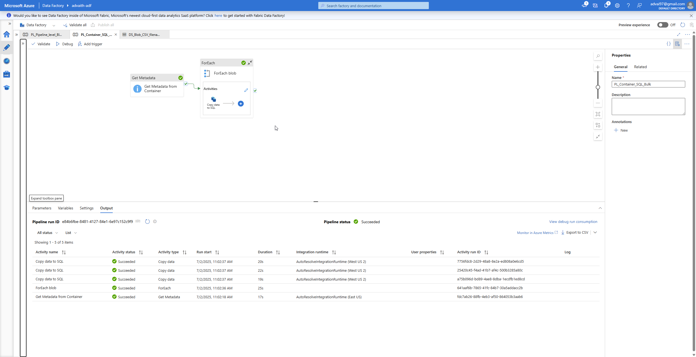
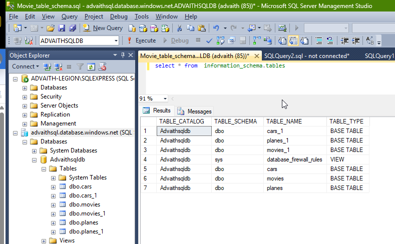

# 📄 Bulk CSV to Azure SQL Pipeline

This Azure Data Factory (ADF) pipeline automates the ingestion of multiple CSV files from a blob storage folder into corresponding tables in an Azure SQL Database. It dynamically detects files, iterates over them, and loads each into its own table using a parameterized design.

---

## 🚀 What This Pipeline Does

- Reads all CSV files from the folder `datasets/test` in a blob storage container.
- Uses a `Get Metadata` activity to list all file names (`childItems`) in the folder.
- Iterates through each file name using a `ForEach` activity.
- Copies each file’s content into a new Azure SQL table named after the file (with `.csv` extension removed).
- Auto-creates the destination SQL tables (`tableOption: autoCreate`).

---

## 🔗 Linked Services

| Name                  | Type               | Description                    |
|-----------------------|--------------------|--------------------------------|
| `LS_AzureBlobStorage` | Azure Blob Storage | Source for input CSV files     |
| `LS_AzureSqlDatabase` | Azure SQL Database | Destination for table loading  |

---

## 📦 Datasets

| Name                          | Type             | Parameterized | Purpose                                    |
|-------------------------------|------------------|---------------|--------------------------------------------|
| `DS_Container_CSV`            | Delimited Text   | ❌             | Used in Get Metadata to fetch file list    |
| `DS_Blob_CSV_filename_generic`| Delimited Text   | ✅ `filename`  | Reads each CSV file in ForEach             |
| `DS_SQL_table_create`         | Azure SQL Table  | ✅ `tablename` | Target SQL table created per file name     |

---

## 🧬 Parameters and Expressions

- **Source Dataset Parameter**:  
  `@item().name` — passed as `filename` to read each CSV.

- **Sink Dataset Parameter**:  
  `@replace(item().name, '.csv', '')` — strips extension to use as SQL table name.

---

## 🖼️ Screenshots

Pipeline Diagram with successful execution:

- 

Input files in `datasets/test` in the storage account:

- 

List of output SQL tables created. Each table corresponds to the file name (without `.csv`) and contains the CSV data.

- 

SQL Table data preview for planes_1 table:

- 

---

## ⚠️ Notes & Assumptions

- Assumes each file has a header row and consistent schema structure for automatic table creation.
- Tables are auto-created based on file name. Re-running the pipeline **may overwrite** or re-create existing tables depending on database setup.
- All files are written into the **`dbo`** schema.
- We need to ensure file names are valid as SQL table names; this pipeline just strips `.csv` extension but does not sanitize further. Further sanitization logic may be added to future proof any file name as ideal sql table name which is out of scope for this demonstration.

---
Thank you for reviewing this project! If you have any questions or suggestions, feel free to reach out.
