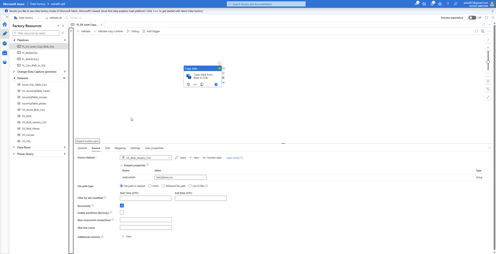
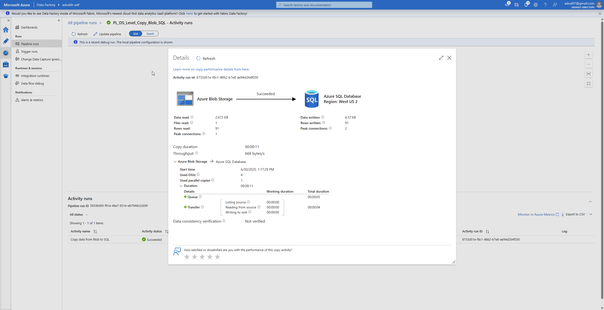
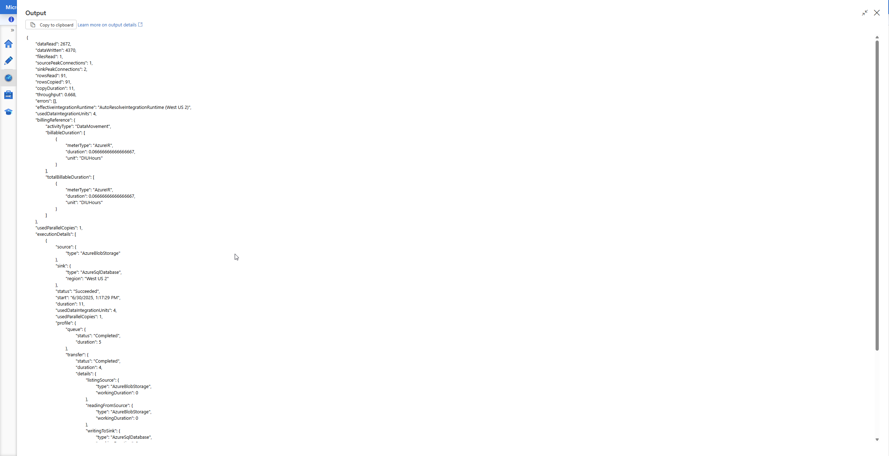
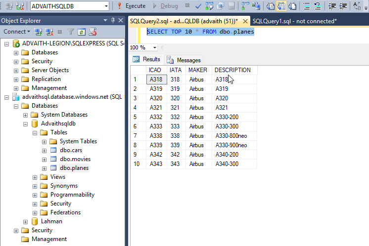

# 📦 ADF Pipeline: Parameterized CSV to Azure SQL Copy

This Azure Data Factory pipeline demonstrates an efficient and reusable method for copying CSV files from Azure Blob Storage into Azure SQL Database. By leveraging dataset-level parameters, the same copy activity can ingest multiple source files into their respective destination tables—making it a scalable template for similar ingestion workflows.

---

## 🚀 What This Pipeline Does

- Reads CSV files from Azure Blob Storage using a parameterized dataset.
- Writes data into Azure SQL Database tables using another parameterized dataset.
- Uses a single copy activity to support multiple datasets with minimal duplication.
- Enables flexibility and scalability for data ingestion workflows.

---

## 🔗 Linked Services

| Name                      | Type                | Description                         |
|---------------------------|---------------------|-------------------------------------|
| `DS_AzureBlobStorage_param` | Azure Blob Storage  | Points to blob container with CSVs  |
| `LS_AzureSqlDatabase`     | Azure SQL Database  | Connection to the target SQL DB     |

---

## 🗂️ Datasets (Sources & Sinks)

| Name                    | Type            | Parameters Used         | Description                              |
|-------------------------|-----------------|--------------------------|------------------------------------------|
| `DS_Blob_Generic_CSV`   | DelimitedText   | `relativePath` (string)  | Generic dataset to point to any CSV file |
| `DS_AzureSqlTable_Param`| AzureSqlTable   | `tablename` (string)     | Parameterized sink for SQL table writes  |

---

## 🧱 SQL Table Schema Example: `planes`

```sql
CREATE TABLE [dbo].[planes](
  [ICAO] [varchar](500),
  [IATA] [varchar](500),
  [MAKER] [varchar](500),
  [DESCRIPTION] [varchar](500)
)
```

---

## 🖼️ Screenshots

- **Pipeline Diagram**  
  

- **Pipeline Run Monitoring**  
  

- **Copy Activity Metrics Output**  
  

- **SQL Table Result**  
  

---

## 🎯 Why I Built This

I wanted to understand how to build scalable, reusable data pipelines in Azure Data Factory. This project helped me apply best practices such as parameterized datasets and centralized copy logic, laying a strong foundation for more complex ingestion tasks in future data engineering roles.

---

## ⚙️ Pipeline Details

| Property                  | Value                            |
|---------------------------|----------------------------------|
| Pipeline Name             | `PL_DS_Level_Copy_Blob_SQL`      |
| Copy Activity Name        | `Copy data from Blob to SQL`     |
| Source Read Settings      | Recursive read (false)           |
| Destination Write Mode    | Insert                           |
| Translation               | Tabular with type conversion     |
| Write Behavior            | Insert without table lock        |

---

## 📁 Files in This Folder

| File Name                        | Description                                      |
|----------------------------------|--------------------------------------------------|
| `PL_DS_Level_Copy_Blob_SQL.json`| Pipeline JSON definition                         |
| `DS_Blob_Generic_CSV.json`      | Parameterized source dataset (CSV)               |
| `DS_AzureSqlTable_Param.json`   | Parameterized sink dataset (SQL)                 |
| `DS_AzureBlobStorage_param.json`| Linked service for Blob                          |
| `tables_schema.sql`             | Planes SQL table structure                       |

---

## 🔧 What's Next

- Try pipeline level parametrization
- Enable fault tolerance and retry logic for failures.
- Automate metadata-driven ingestion using Lookup + ForEach activities.

---

Thanks for checking out this project! Feel free to explore the files and use this as a reference for your own ADF pipelines.