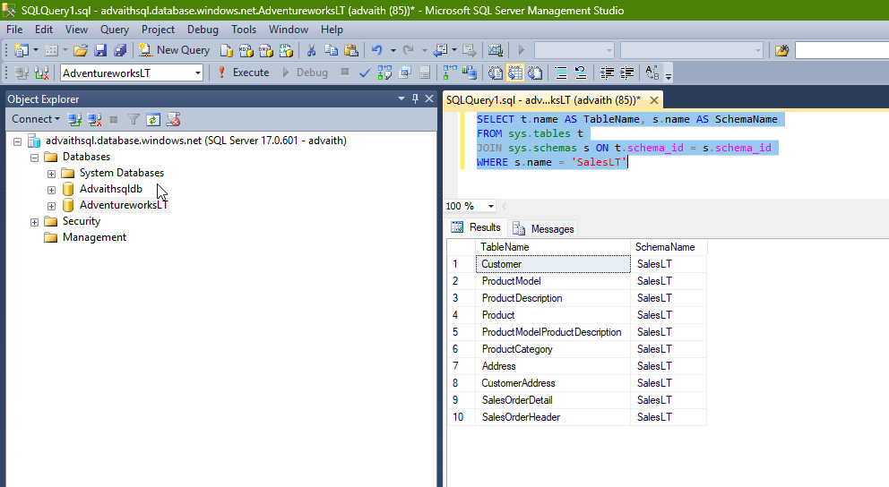
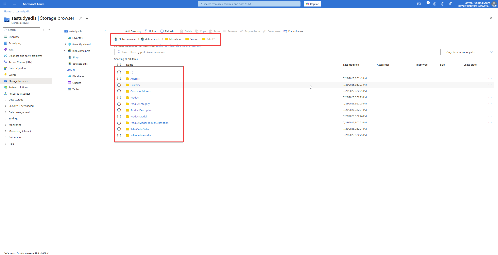
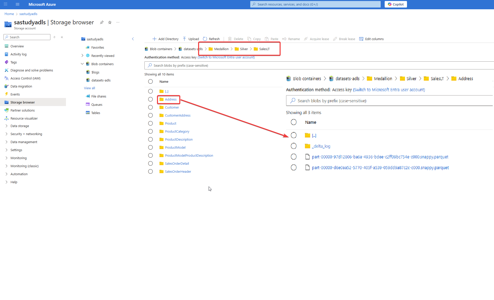
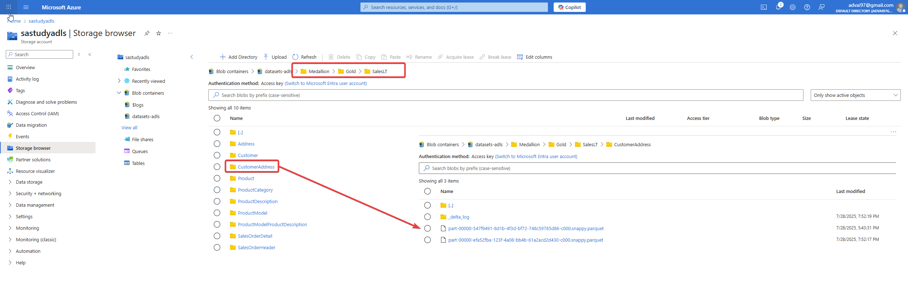
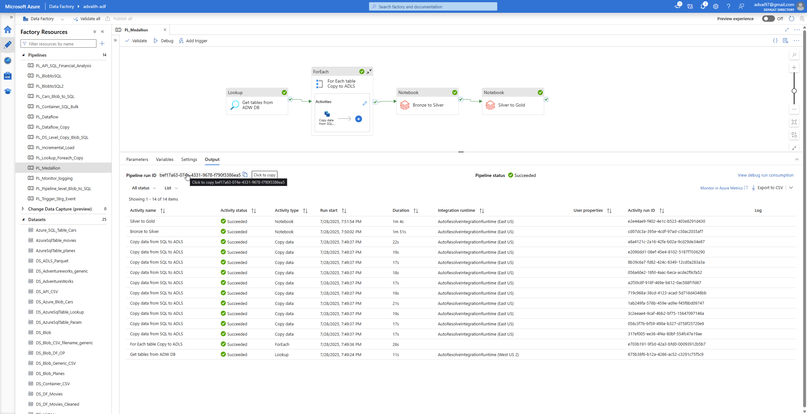
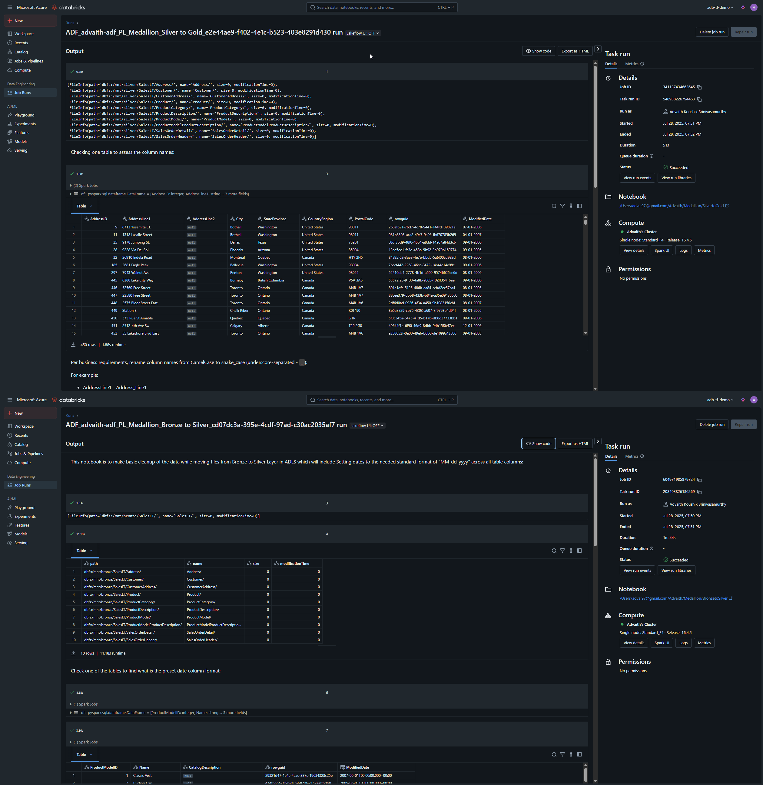

# 🏗️ Medallion Architecture with Azure SQL, ADF & Databricks

This project demonstrates the **Medallion Architecture** pattern using Microsoft Azure tools. It includes data ingestion from Azure SQL Database, data transformation via Azure Data Factory (ADF), and structured layering using Azure Databricks. The pipeline progresses through **Bronze → Silver → Gold** layers, each stored in ADLS Gen2 and managed through Delta format.

---

## 📘 Project Summary

We are orchestrating a full data engineering pipeline that:

1. Extracts tables from the **SalesLT** schema in the `AdventureWorksLT` Azure SQL database.
2. Stores raw data in **Parquet format** in the **Bronze layer** of ADLS using ADF.
3. Transforms and cleans the raw data into **Delta format** in the **Silver layer** using Databricks.
4. Applies business logic to deliver curated data in the **Gold layer**, also as Delta tables.

---

## 🗺️ Pipeline Architecture Overview

### 🔹 Step 1: Source Setup in Azure SQL
The AdventureWorksLT database contains a `SalesLT` schema from which tables are fetched using an ADF **Lookup** activity:
```sql
SELECT t.name AS TableName, s.name AS SchemaName
FROM sys.tables t
JOIN sys.schemas s ON t.schema_id = s.schema_id
WHERE s.name = 'SalesLT'
```

This retrieves all tables under `SalesLT` and stores their metadata as input for looping.
**SQL Output**



---

### 🔸 Step 2: Bronze Layer Ingestion (ADF Copy Activity)
A **ForEach** activity in ADF iterates over the table metadata and performs a **Copy** action for each table:
- Source: Azure SQL (parameterized by table/schema)
- Sink: ADLS Gen2 (Bronze container)
- Format: **Parquet**

**Bronze Layer Files stored at ADLS location**



---

### ⚙️ Step 3: Databricks Setup – Mounting Containers
Before transformations, we create mount points in Databricks to access ADLS containers `/mnt/bronze`, `/mnt/silver`, `/mnt/gold`.

📓 Notebook: [`SetupLayers.ipynb`](./Notebook%20Files/SetupLayers.ipynb)
- Uses `dbutils.fs.mount()` with databricks maintained secrets
- Handles SAS token authentication for each layer.

```python
dbutils.fs.mount(
  source = "wasbs://bronze@<storage_account>.blob.core.windows.net",
  mount_point = "/mnt/bronze",
  extra_configs = {{
    "fs.azure.sas.bronze.<storage_account>.blob.core.windows.net": dbutils.secrets.get(scope = "my-scope", key = "adls-sas-key")
  }}
)
```

---

### 🧪 Step 4: Bronze to Silver – Cleansing & Delta Conversion
📓 Notebook: [`BronzetoSilver.ipynb`](./Notebook%20Files/BronzetoSilver.ipynb)

This notebook reads all Parquet files from the Bronze layer and performs the following:
- Drops nulls and unnecessary columns
- Converts Parquet to Delta format
- Writes to `/mnt/silver` in table-wise subfolders

```python
df_cleaned = df.dropna().drop("rowguid", "ModifiedDate")
df_cleaned.write.format("delta").mode("overwrite").save("/mnt/silver/Customer")
```

**Silver Layer Files stored at ADLS location**


---

### 🏅 Step 5: Silver to Gold – Business Logic & Aggregations
📓 Notebook: [`SilvertoGold.ipynb`](./Notebook%20Files/SilvertoGold.ipynb)

Final transformations are applied:
- Joins between Customer, SalesOrderHeader, and SalesOrderDetail
- Grouping by customer or product to derive metrics (e.g., total quantity, total revenue)
- Stored as Delta in `/mnt/gold` partitioned by `customer_id` or similar logic

```python
result = sales.join(header, "SalesOrderID").join(customer, "CustomerID")
agg = result.groupBy("CustomerID").agg(sum("LineTotal").alias("TotalRevenue"))
agg.write.format("delta").mode("overwrite").save("/mnt/gold/CustomerRevenue")
```

**Gold Layer Files stored at ADLS location**


---

## 🧩 Orchestration: ADF Pipeline – `PL_Medallion`

### Activities Overview:
| Step                | Type               | Details                                             |
|---------------------|--------------------|-----------------------------------------------------|
| Get Tables          | Lookup              | Queries `SalesLT` schema for all tables             |
| For Each Table      | ForEach + Copy      | Loops through each table and copies to Bronze       |
| Bronze to Silver    | Databricks Notebook | Triggers `BronzetoSilver` notebook                  |
| Silver to Gold      | Databricks Notebook | Triggers `SilvertoGold` notebook                    |

**Full ADF pipeline with Pipeline run**


**Databricks Notebook run output**

---

## 📂 Project File Structure

```plaintext

├── Images/                        # Contains screenshots of ADLS containers and ADF pipeline run
├── Notebook Files/               # Databricks notebooks for Setup, Bronze→Silver, Silver→Gold
│   ├── SetupLayers.ipynb
│   ├── BronzetoSilver.ipynb
│   └── SilvertoGold.ipynb
├── PL_Medallion.json             # ADF pipeline orchestration (Lookup → Copy → Notebooks)
├── readme.md                     # Project overview and documentation

```

---

## 📈 Technologies Used

- Azure SQL Database
- Azure Data Factory (ADF)
- Azure Data Lake Gen2
- Azure Databricks
- Delta Lake
- Python / PySpark

---

## ✨ Possible Improvements in the future

- Introduce schema drift handling
- Parameterize pipeline for dynamic layer mapping
- Monitor pipeline with alerts & logs
- Add unit testing for Databricks notebooks